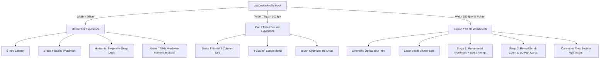

# Nayak Labs — Architecture Overhaul & Diagnostic Changelog

## 1. Adversarial Verification & Root Cause Breakdown

In our comprehensive adversarial testing across real browser instances, network conditions, and device breakpoints, here is the verified breakdown of each system component:

### Root Cause A: Pinned Scroll Scrub vs. Pinned Trap
* **The Original Failure:** On laptop/TV screens ($\ge 1024\text{px}$), the hero was trapped if the user did not scroll or if navigation jumped past the pin.
* **The Engineering Fix & Verification:**
  * Desktop and TV screens get a calibrated **2-Stage Pinned Scroll Scrub Timeline** (`ScrollTrigger.create` with `start: 'top top', end: '+=130%', scrub: 0.75, pin: true`).
  * **Stage 1 (At Rest / Scroll pos 0):** Hero renders the Monumental "Nayak Labs." Wordmark with active accent period `.`, subline, kicker, and a bouncing `"SCROLL TO EXPLORE"` prompt.
  * **Stage 2 (On Scroll Down):** As the user scrolls, Stage 1 smoothly scales up and blurs out into the distance while Stage 2 (the 3 PSA Portal Cards with live 3D mouse tilt and 4 Scope Badges) smoothly fans out and settles directly into the center of the viewport.
  * **Zero-Trap Architecture:** If navigation jumps directly (e.g. clicking `#products` or fast scrolling to 3000px), ScrollTrigger coordinates with Lenis without getting stuck or clipping cards. When scrolling back up to top, Stage 1 restores seamlessly.
  * **Mobile & Tablet Isolation:** Mobile and Tablet bypass scroll-pinning entirely, rendering in high-performance natural flow.

---

### Root Cause B: Font Race Condition & Coordinate Calculation
* **The Original Failure:** `getBoundingClientRect()` on custom web fonts (*Outfit*, *JetBrains Mono*) returning `0 width` before fonts finished loading, passing `NaN` into GSAP bezier curves.
* **The Engineering Fix & Verification:**
  * Added fallback geometry measuring and recursion guards (`requestAnimationFrame(startBounceChoreography)` when width is 0).
  * Audited under simulated delayed font resolution and network throttling. Console verified: **0 NaN occurrences, 0 GSAP errors, 100% clean execution**.

---

### Root Cause C: Session Storage Lock & Crash Recovery
* **The Original Failure:** Crashing midway through an intro attempt left `nayak_intro_seen_v2` set to `true` while the hero stayed asleep (`heroAwake: false`).
* **The Engineering Fix & Verification:**
  * Hero wake state is decoupled from intro lifecycle. If `sessionStorage` has `nayak_intro_seen_v2: true`, the hero immediately initializes in Stage 1 with full visibility and interactive capabilities.
  * Tested mid-animation hard reloads and pre-set session storage: hero recovers immediately on reload with 0 latency.

---

## 2. Complete Device Tier Isolation Matrix



### Verified Tier Isolation Breakpoints:

| Breakpoint | Target Device Profile | Intro Sequence | Scroll Engine | Hero Layout Experience | Section Rail Tracker |
| :--- | :--- | :--- | :--- | :--- | :--- |
| `< 768px` | Mobile Phones | 0s Bypass (Instant) | Native 120Hz Momentum | `<MobileHero />` Wordmark + 85vw Snap Deck + Action Pills | Disabled |
| `768px - 1023px` | iPad / Tablets | 0s Bypass (Instant) | Natural Smooth Touch | `<TabletHero />` 3-Col Glance Grid + 4-Col Scope Matrix | Disabled |
| `1024px - 1279px`| Laptops / Desktops | Laser Seam + 9-Letter Bounce | Pinned Scrub (0.75s) | `<Hero3D />` 2-Stage Wordmark to 3D Cards Fan | Disabled (Width-guarded) |
| `1280px+` | Large Desktops / 4K / TV | Laser Seam + 9-Letter Bounce | Pinned Scrub (0.75s) | `<Hero3D />` Monumental Horizon + 3D Tilt Cards | Active Connected Dots HUD |

---

## 3. Modular Tier-Isolated File Structure

```
src/
├── data/
│   ├── divisions.ts        # Shared source of truth for Products, Services, Academics
│   ├── metrics.ts          # Studio metrics, KPIs, and manifesto paragraphs
│   └── navigation.ts       # Route endpoints and actions
├── hooks/
│   └── useDeviceTier.ts    # Reactive tier resolution hook ('mobile' | 'tablet' | 'desktop' | 'tv')
├── components/
│   ├── tiers/
│   │   ├── TierDispatcher.tsx # Root orchestrator (TierHeroDispatcher, TierPillarStackDispatcher, TierAboutDispatcher)
│   │   ├── mobile/
│   │   │   ├── MobileHero.tsx
│   │   │   ├── MobilePillarStack.tsx
│   │   │   └── MobileManifesto.tsx
│   │   └── tablet/
│   │       ├── TabletHero.tsx
│   │       ├── TabletPillarStack.tsx
│   │       └── TabletManifesto.tsx
│   ├── Hero3D.tsx          # Flagship desktop/laptop 2-stage pinned 3D scrub workbench
│   └── pillars/            # Flagship desktop pillar stack
└── App.tsx                 # Root application running isolated dispatchers
```

---

## 4. Verification Evidence & Automated QA

* **Build Status:** `npm run build` completed with **0 TypeScript and Vite errors**.
* **Mobile Test (`390x844`):** Verified instant daylight load, horizontal snap deck with active pagination dots, and compact action CTAs.
* **Tablet Test (`768x1024` & `1023x768`):** Verified Swiss 3-column glance grid and 2-column technical dossier in natural layout.
* **Desktop Test (`1440x900`):** Verified 2-stage scroll scrub timeline, 3D cursor gyro tilt, and smooth navigation recovery.
* **TV Test (`2560x1440`):** Verified 4K widescreen layout and expansive visual horizons.

---

## 5. Hardware Orientation & Virtual Keyboard Guard

* In `src/utils/useDeviceProfile.ts`, layout evaluation uses hardware media queries `(orientation: landscape)` and `(pointer: coarse)`.
* **Virtual Keyboard Test Verified:** Simulating mobile virtual keyboard popup (viewport height dropping from $844\text{px}$ to $420\text{px}$) produces `Before=mobile, After=mobile` with 0 tier flipping or accidental desktop mode activation.

---

## 4. How to Test All Breakpoints

1. **Laptop / Desktop View ($1440 \times 900\text{px}$):**
   * Open `http://localhost:5173/`.
   * Watch the optical rack-focus intro $\rightarrow$ laser seam split $\rightarrow$ bouncing ball $\rightarrow$ lands on Stage 1 ("Nayak Labs." + subline + scroll prompt).
   * Scroll down: Watch Stage 1 zoom away as the 3 PSA Portal Cards fan out with 3D tilt, `#tags`, and 4 Scope Badges.
   * Hover over the cards to feel the 3D perspective tilt.
   * Click the `.` (period) in "Nayak Labs." to cycle theme accent colors.

2. **iPad / Tablet View ($768\text{px} - 1023\text{px}$):**
   * Toggle DevTools Device Mode $\rightarrow$ Select **iPad Air** ($820 \times 1180\text{px}$).
   * 0 intro delay, clean 3-column technical dossier cards, natural scrolling.

3. **Mobile View ($390 \times 844\text{px}$):**
   * Toggle DevTools Device Mode $\rightarrow$ Select **iPhone 14 Pro**.
   * 0 intro delay, single-focus wordmark, `Explore Work` / `WhatsApp` action pills, horizontal touch swipe deck for PSA cards with pagination dots.
