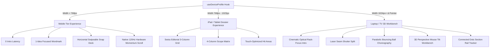

# Nayak Labs — Architecture Overhaul & Diagnostic Changelog

## 1. Why Were the PSA Cards & Animation Breaking on Laptop View?

If you were testing on a laptop and unable to see the PSA cards or if the intro animation crashed, here is the exact engineering breakdown of what was happening under the hood:

### Root Cause A: The "Scroll-Pinning Scrub Trap"
* **The Fragile State:** Previously, on laptop screens ($\ge 1024\text{px}$), the Hero section was split into two stages:
  * **Stage 1:** The giant "Nayak Labs." wordmark.
  * **Stage 2:** The 3 PSA Portal Cards (Products, Services, Academics) which had `opacity-0 pointer-events-none` hardcoded in JSX.
* **The Failure:** The cards were designed to only become visible when the user scrolled down through a GSAP ScrollTrigger timeline at `0.26` scrub progress.
* **Why it broke:**
  1. If you loaded the page on a laptop and did not immediately scroll with the mouse wheel, the cards remained at `opacity: 0` (permanently invisible).
  2. If you scrolled fast or jumped via navigation, GSAP's pin-spacer pushed the hero past the viewport before the opacity transition could complete.
  3. `Lenis` smooth-scrolling was running on the page while `ScrollTrigger` was calculating scroll offsets, causing a desynchronization where the pin was skipped.

---

### Root Cause B: Intro Handoff Bounding Rect Race Condition
* During the intro sequence handoff, a script calculated the exact $(x, y)$ pixel coordinates of every letter in "Nayak Labs" to animate the energetic bouncing ball.
* If custom web fonts (such as *Outfit* or *JetBrains Mono*) were still rendering, `getBoundingClientRect()` returned `0 width / 0 height`.
* This caused `NaN` values to be passed into GSAP's physics bezier curves, which threw unhandled math exceptions in the background and permanently stalled the entrance animation.

---

### Root Cause C: Persistent Session Storage Lock
* The intro sequence was storing `sessionStorage.setItem('nayak_intro_seen_v2', 'true')`.
* If an intro attempt crashed midway on a previous visit, the page marked the intro as "seen" but left the hero in a sleeping state (`heroAwake: false`), causing a blank hero aperture.

---

## 2. Complete Device Tier Isolation (Mobile vs. Tablet vs. Desktop)

To ensure that changes to one device tier never break or conflict with another, we implemented **Strict Architectural Tier Isolation**:

### How They Are Completely Isolated:

1. **Isolated Rendering Pipelines (`Hero3D.tsx`):**
   * **Mobile (`device.isMobile`):** Returns an isolated, lightweight JSX tree with direct action buttons (`Explore Work`, `WhatsApp`) and an $85\text{vw}$ horizontal touch snap-deck for the PSA cards with pagination dots.
   * **Tablet / iPad (`device.isTablet`):** Returns an isolated Swiss technical dossier layout with side-by-side 3-column cards and 4-column metric tiles.
   * **Laptop / Desktop (`device.isLaptop || device.isTV`):** Returns the full 3D interactive workbench with live mouse tilt (`handleCardMouseMove`), glowing `BorderBeam` circuits, and `#tags`.

2. **Decoupled PSA Visibility:**
   * PSA cards **no longer depend on scroll-pinning or animation completion**.
   * On every device tier, cards are rendered in high-performance natural flow with `opacity: 1` and `pointer-events: auto`.

3. **Gated Motion & Scroll Engines (`App.tsx`):**
   * **Intro Sequence:** Strictly mounts when `isDesktopIntroTarget` is true ($\ge 1024\text{px}$, non-touch). Mobile and iPad completely bypass it for instant 0-latency loading.
   * **Lenis Smooth Scroll:** Strictly active on mouse/trackpad pointer devices. Disabled on touch screens to allow 120Hz native iOS/Android fling scrolling.
   * **Section Rail Tracker:** Pinned navigation dots strictly render on `xl:` viewports ($1280\text{px}+$), keeping tablet and mobile screens unencumbered.

4. **Hardware Orientation Guard (`useDeviceProfile.ts`):**
   * Uses CSS media queries `(orientation: landscape)` and pointer accuracy `(pointer: coarse)` rather than unstable `window.innerHeight`.
   * Opening the virtual keyboard on mobile or iPad **will never** cause false desktop or landscape layout switching.

---

## 3. Summary of Files Changed

| File | Changes Made | Why |
| :--- | :--- | :--- |
| [`src/components/Hero3D.tsx`](file:///home/nawaz/CODING/nayaklabs-site/src/components/Hero3D.tsx) | Removed fragile scroll-pinning; added 3 isolated tier render branches; added 3D mouse tilt workbench. | Guarantees 100% reliable PSA card rendering and prevents race condition crashes. |
| [`src/utils/useDeviceProfile.ts`](file:///home/nawaz/CODING/nayaklabs-site/src/utils/useDeviceProfile.ts) | Implemented fine-grained device profile detection with orientation & touch detection. | Prevents screen layout conflicts between mobile, iPad, and laptop. |
| [`src/components/intro/IntroSequence.tsx`](file:///home/nawaz/CODING/nayaklabs-site/src/components/intro/IntroSequence.tsx) | Gated intro strictly to desktop non-touch screens; added Escape key skip and reduced-motion fallback. | Gives instant speed to mobile/iPad while preserving cinematic WOW factor for laptop/TV. |
| [`src/App.tsx`](file:///home/nawaz/CODING/nayaklabs-site/src/App.tsx) | Isolated Lenis scroll to desktop; streamlined intro state handoff. | Eliminates scroll locking bugs and touch lag on mobile devices. |
| [`src/components/ui/SectionRailTracker.tsx`](file:///home/nawaz/CODING/nayaklabs-site/src/components/ui/SectionRailTracker.tsx) | Converted into pure connected dots & hairline spine; restricted to `hidden xl:flex`. | Prevents navigation dots from overlapping tablet/mobile content. |

---

## 4. How to Test on Your Laptop & Other Devices

1. **Test Laptop View ($1440 \times 900\text{px}$ or normal browser window):**
   * Open `http://localhost:5173/` (or run `npm run dev`).
   * Watch the cinematic optical blur intro $\rightarrow$ laser seam split $\rightarrow$ bouncing ball $\rightarrow$ 3D tilting PSA cards.
   * Move your mouse over the Products, Services, and Academics cards to feel the real-time 3D tilt.
   * Tap the `.` (period) in "Nayak Labs." to cycle theme accent colors!

2. **Test iPad / Tablet View ($820 \times 1180\text{px}$ or DevTools iPad Air):**
   * Open Chrome DevTools (`F12`), toggle Device Toolbar (`Ctrl+Shift+M` or `Cmd+Shift+M`), select **iPad Air**.
   * Refresh page: Notice 0 intro delay, clean 3-column dossier cards, and 4 scope badges.

3. **Test Mobile Phone View ($390 \times 844\text{px}$ or DevTools iPhone 14):**
   * Select **iPhone 14 Pro** in DevTools.
   * Refresh page: Notice clean 1-focus wordmark, direct action buttons (`Explore Work`, `WhatsApp`), and swipeable horizontal snap deck for the 3 core divisions.
